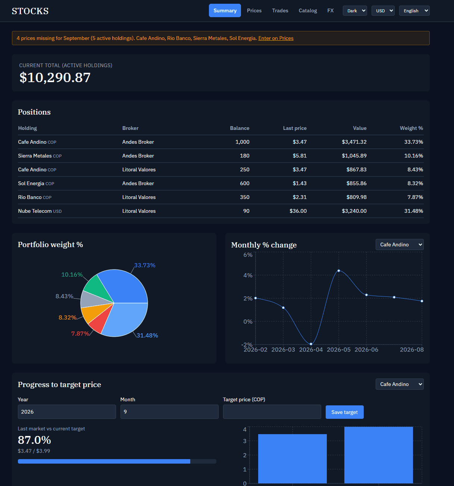
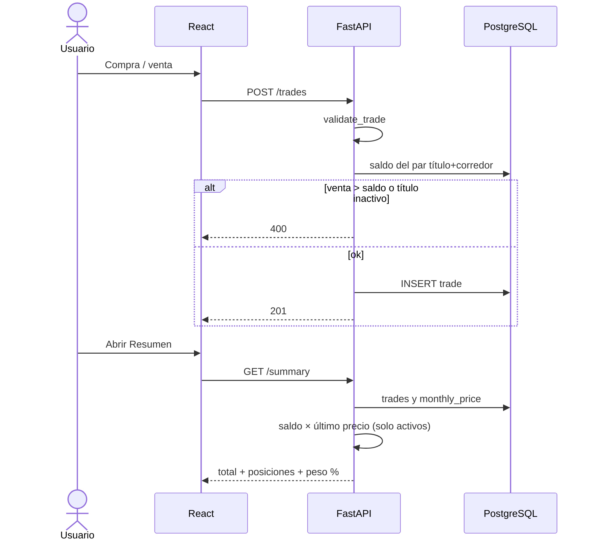
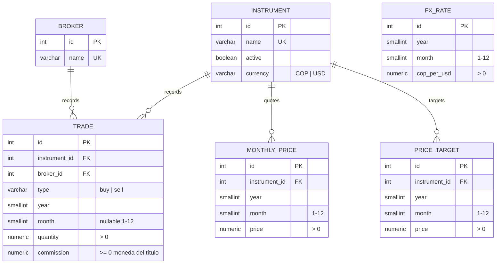
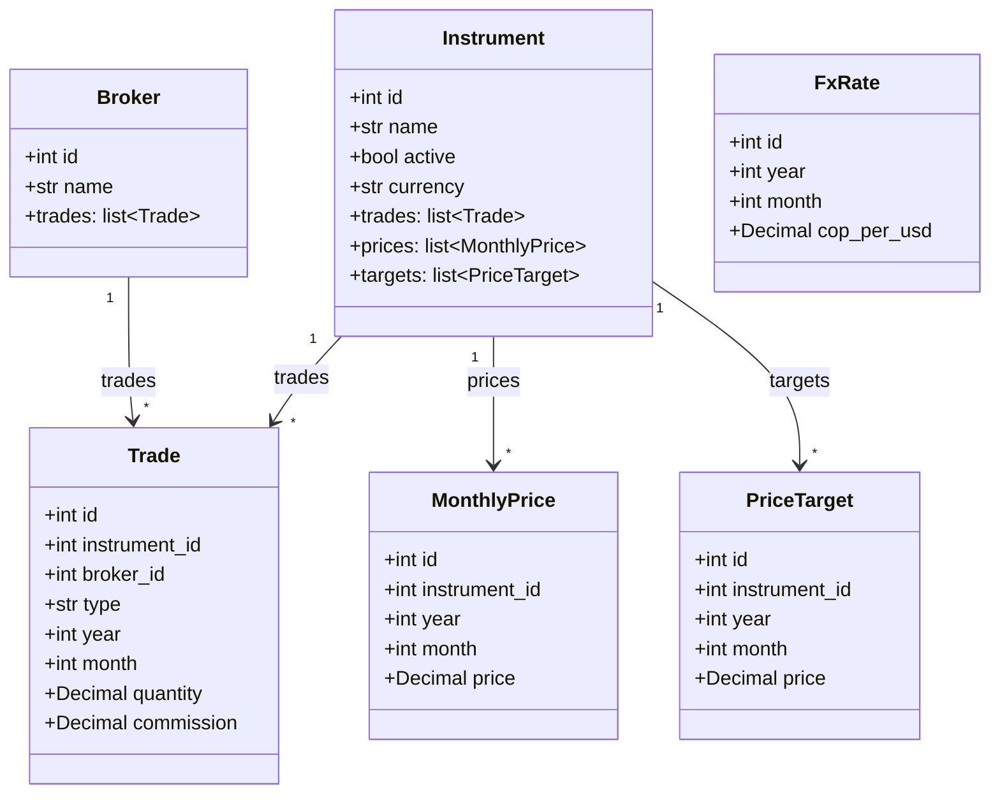

# Acciones

[English](README.md) | **Español**


Registro y seguimiento de un portafolio de acciones de Colombia (COP) y de Estados Unidos (USD). Se cargan a mano las compras, las ventas, la comisión de cada operación, el precio de mercado mes a mes y el precio objetivo de venta por título. El saldo, el valor actual, los porcentajes y el avance al objetivo se calculan; no se guardan duplicados.

## Características

- **Catálogo** de títulos (instrumentos) y corredores, con nombres únicos. Cada título tiene moneda de cotización: **COP** o **USD**.
- **Estado activo / inactivo** por título. Un inactivo no suma al total ni aparece en el peso %. Precios y movimientos se conservan.
- **Compras y ventas** por par título + corredor (año obligatorio, mes opcional, cantidad > 0, **comisión en la moneda del título** ≥ 0).
- **Saldo calculado**: `compras − ventas` por corredor. Venta parcial baja el saldo; venta total lo deja en 0; venta mayor al saldo se rechaza. No hay saldo negativo.
- **Precios mensuales** por título (no por corredor), en una grilla año × mes.
- **Aviso de precios del mes**: si a un título activo le falta el precio del mes en curso, Resumen y Precios muestran un banner. En Precios, esas celdas se marcan. El mes lo toma el navegador (no el reloj UTC del contenedor).
- **Precio objetivo de venta** por título, un valor por mes. El historial se conserva; el vigente es el de fecha más reciente. Mismo mes = se actualiza.
- **Resumen**: total actual = Σ (`saldo × último precio`) solo de títulos **activos**. Si falta precio, la posición se marca “sin precio” y no entra al total.
- **Gráficas**: peso % del portafolio (torta), variación % mensual del precio (línea) y **avance al objetivo** (`último mercado / objetivo vigente`). Un mes hueco no inventa variación ni avance.
- **Tema, idioma y moneda de pantalla**: selects compactos en el header (oscuro / claro, ES / EN / IT, COP / USD). La preferencia se guarda en `localStorage`. Los nombres de títulos y corredores no se traducen.
- **Moneda del título vs vista**: precios, objetivos y comisión se guardan en la moneda del título. El toggle COP / USD del header convierte con la TRM de ese mes (`cop_per_usd`). Si la vista es la misma moneda, no hace falta tasa. Si falta la TRM para un monto cruzado, se muestra “sin TRM”; no se inventa.
- **Seed** inicial: 11 títulos (Ecopetrol, Celsia, ETB, GEB, Mineros, PG Argos, PG SURA, Cemagros, PF Cemagros, Grupo Argos, Grupo Sura), todos **COP**, y 2 corredores (D Corredores, Trii).


## Demo



Portafolio ficticio en `demo/demo.sql`. Para levantarlo en local, ver [Probar con la base de demo](#probar-con-la-base-de-demo).

### Reglas de negocio


| Situación                                              | Comportamiento                                                       |
| ------------------------------------------------------ | -------------------------------------------------------------------- |
| Mismo título en dos corredores                         | Dos tenencias, un solo precio de mercado                             |
| Inactivar con saldo > 0 (suma de todos los corredores) | Error 400                                                            |
| Compra de un título inactivo                           | Error 400; hay que reactivarlo primero                               |
| Borrar un movimiento si el saldo quedaría negativo     | Error 400                                                            |
| Borrar título o corredor con datos asociados           | Error 409                                                            |
| Variación de un mes                                    | Solo si existe precio en ese mes **y** en el mes calendario anterior |
| Comisión                                               | ≥ 0 en la moneda del título; no entra al total                       |
| Cambiar la moneda de cotización de un título           | Error 400 si ya tiene movimientos, precios u objetivos               |
| Avance al objetivo                                     | Solo si hay precio de mercado **y** objetivo vigente                 |
| Precios pendientes del mes                             | Solo títulos **activos** sin celda en el mes en curso                |
| Vista cruzada sin TRM de ese mes                       | No se convierte; se muestra “sin TRM”                                |


Moneda persistida: **COP o USD por título**. El toggle del header es solo presentación: `monto_usd = monto_cop / cop_per_usd` y `monto_cop = monto_usd × cop_per_usd` con la TRM **de ese mes**.

## Cómo funciona

Flujo típico: dar de alta título (COP o USD) y corredor → registrar compras (comisión en esa moneda) → si el banner avisa, cargar precios del mes → fijar objetivo de venta → ver total, peso %, variación y avance en Resumen. El toggle del header muestra el mix en COP o USD.




Al arrancar el contenedor `api` se ejecuta la migración Alembic, el seed del catálogo y Uvicorn.

## Stack


| Capa         | Tecnología                                                                      |
| ------------ | ------------------------------------------------------------------------------- |
| UI           | React 19, TypeScript, Vite 6, Tailwind CSS 3, React Router 7, Recharts, i18next |
| API          | Python 3.12, FastAPI, Pydantic v2, uv                                           |
| Persistencia | PostgreSQL 16, SQLAlchemy 2, Alembic                                            |
| Pruebas      | pytest, httpx (`TestClient`)                                                    |
| Empaquetado  | Docker Compose (servicios `db`, `api`, `web`)                                   |


## Cómo corre

### Con Docker (recomendado)

Requisitos: Docker Desktop.

Copia las variables de entorno a (`.env`):

```bash
cp .env.example .env   # Windows: copy .env.example .env
docker compose up --build
```

Nota: Edita `.env` antes del primer `up` si quieres otras claves. Si Postgres ya se inicializó con el volumen `pgdata`, cambiar `POSTGRES_USER` / `POSTGRES_PASSWORD` / `POSTGRES_DB` **no** actualiza esa instancia; hay que borrar el volumen o restaurar un dump.


| Servicio   | URL                                                                                                                         |
| ---------- | --------------------------------------------------------------------------------------------------------------------------- |
| UI         | [http://localhost:5173](http://localhost:5173)                                                                              |
| API        | [http://localhost:8000](http://localhost:8000)                                                                              |
| Salud      | [http://localhost:8000/health](http://localhost:8000/health)                                                                |
| OpenAPI    | [http://localhost:8000/docs](http://localhost:8000/docs)                                                                    |
| PostgreSQL | `localhost:${POSTGRES_PORT}` — usuario / clave / BD en `.env`                                                               |
| pgAdmin    | [http://localhost:${PGADMIN_PORT}](http://localhost:${PGADMIN_PORT}) — `PGADMIN_DEFAULT_EMAIL` / `PGADMIN_DEFAULT_PASSWORD` |


Para dejarlo en segundo plano: `docker compose up --build -d`.

### Probar con la base de demo

El primer arranque solo carga el catálogo (nombres, portafolio vacío). Para ver un ejemplo completo — compras, una venta parcial, precios, objetivos, mix COP/USD — restaura `demo/demo.sql` (esto **pisa** la base actual):

```powershell
docker compose up --build -d
.\backups\backup.ps1 -Restore demo\demo.sql -Force
```

Luego abre [http://localhost:5173](http://localhost:5173). Deberías ver Cafe Andino, Sol Energia, Rio Banco, Sierra Metales (COP) y **Nube Telecom** (USD). Si ya tienes datos que te importan, haz dump antes con `.\backups\backup.ps1`.

pgAdmin viene en el mismo Compose. En el árbol izquierdo abre **Servers → stocks**. La primera vez pide la clave de Postgres (`POSTGRES_PASSWORD`). Host interno: `db` (no `localhost`). Si cambias `POSTGRES_USER` o `POSTGRES_DB`, actualiza `pgadmin/servers.json`.

Solo pgAdmin, sin rebuild del resto:

```bash
docker compose up -d pgadmin
```


### Variables de entorno


| Variable                                              | Uso                                                                                  |
| ----------------------------------------------------- | ------------------------------------------------------------------------------------ |
| `POSTGRES_USER` / `POSTGRES_PASSWORD` / `POSTGRES_DB` | Usuario, clave y nombre de la BD                                                     |
| `POSTGRES_PORT`                                       | Puerto de Postgres en el host (default 5432)                                         |
| `DATABASE_URL`                                        | API/Alembic **fuera** de Compose (`localhost`). Compose monta otra URL con host `db` |
| `VITE_API_URL`                                        | Origen del API que usa el front                                                      |
| `PGADMIN_DEFAULT_EMAIL` / `PGADMIN_DEFAULT_PASSWORD`  | Login de pgAdmin                                                                     |
| `PGADMIN_PORT`                                        | Puerto de pgAdmin en el host (default 5050)                                          |


## Estructura

```
acciones/
├── docker-compose.yml
├── .env.example
├── LICENSE
├── README.md
├── README.es.md
├── backups/backup.ps1
├── demo/
│   ├── demo.sql             # portafolio ficticio (sí va a git)
│   ├── demo.gif             # recorrido en el README
│   └── demo-thumb.png       # preview si hay video en YouTube/Loom
├── pgadmin/servers.json
├── backend/
│   ├── Dockerfile
│   ├── pyproject.toml
│   ├── uv.lock
│   ├── alembic.ini
│   ├── alembic/versions/        # 001 3FN, 002 comisión + objetivo, 003 inglés, 004 TRM, 005 moneda
│   ├── app/
│   │   ├── main.py              # FastAPI, CORS, /health
│   │   ├── config.py            # DATABASE_URL (sin default; sale del entorno)
│   │   ├── database.py          # engine, sesión, Base
│   │   ├── models.py            # ORM 3FN (inglés)
│   │   ├── schemas.py           # Pydantic de entrada/salida
│   │   ├── seed.py              # 11 títulos + 2 corredores (solo si el catálogo está vacío)
│   │   ├── seed_demo.py         # portafolio ficticio del README
│   │   ├── routers/             # brokers, instruments, trades, prices, targets, summary, fx
│   │   └── services/            # rules, balances, variation, target
│   └── tests/
└── frontend/
    ├── Dockerfile
    ├── src/
    │   ├── main.tsx
    │   ├── App.tsx              # rutas, tema, idioma y COP/USD
    │   ├── api.ts               # cliente HTTP
    │   ├── i18n.ts              # es / en / it
    │   ├── theme.tsx            # oscuro / claro
    │   ├── BannerPrecios.tsx    # aviso de huecos del mes en curso
    │   └── pages/               # Summary, Prices, Trades, Catalog, FxRates
    └── ...
```


## Diagrama de la base de datos




Restricciones:

- `instrument.currency` ∈ `{COP, USD}` (default COP).
- `trade.type` ∈ `{buy, sell}`; `quantity > 0`; `commission >= 0`; `month` nulo o entre 1 y 12.
- `monthly_price` y `price_target` únicos por (`instrument_id`, `year`, `month`); `price > 0`.
- `fx_rate` único por (`year`, `month`); `cop_per_usd > 0`.
- FKs: `trade` → `instrument` y `broker`; `monthly_price` y `price_target` → `instrument`.

Por qué es 3FN: cada atributo no clave depende solo de la PK. No se copia el nombre del título en trade, precio ni objetivo. El saldo, el avance y la conversión COP/USD de pantalla se obtienen de consultas.

## Diagrama de clases


### Dominio (SQLAlchemy)




## Licencia

MIT. Ver [LICENSE](LICENSE).

Si este proyecto te resulta útil, considera darle al repositorio una estrella ⭐. Tu apoyo ayuda a que otros lo descubran.