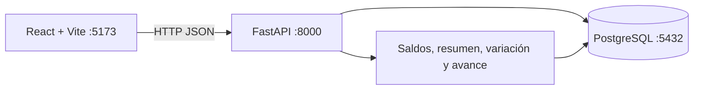
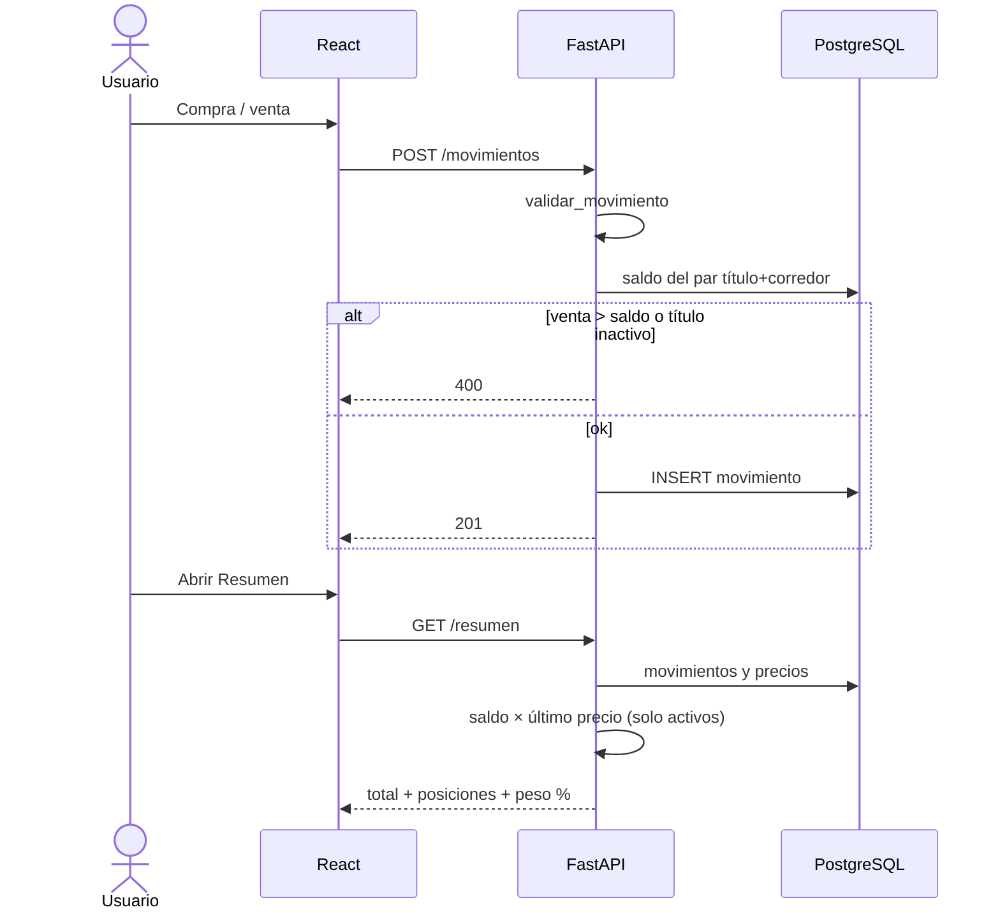
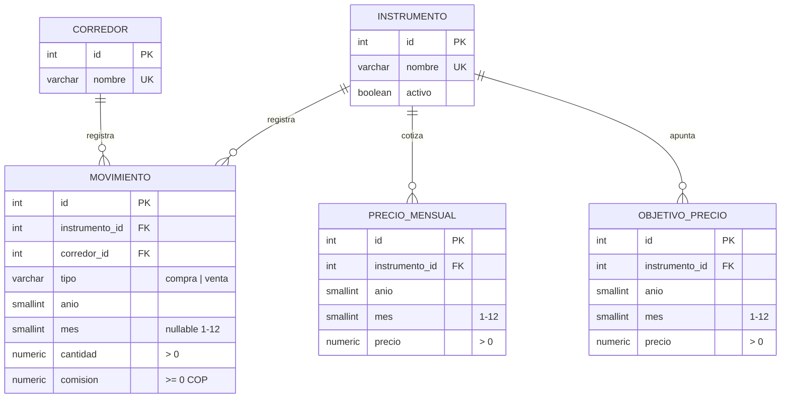
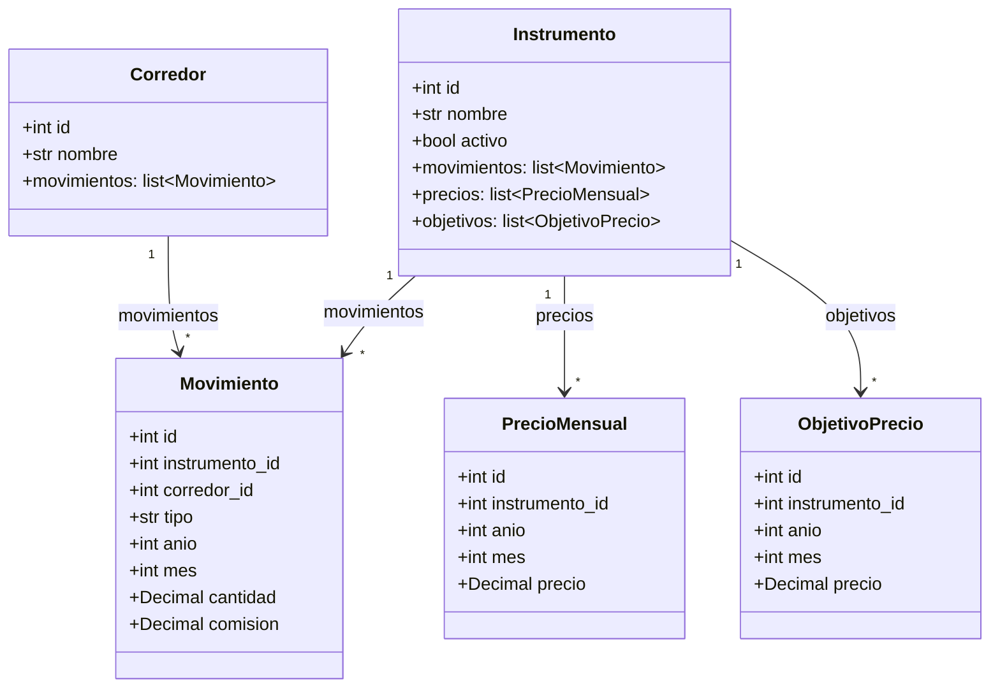
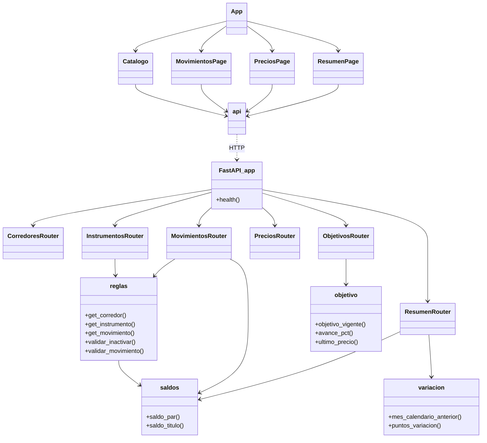

# Acciones

Registro y seguimiento de un portafolio de acciones colombianas (COP). Se cargan a mano las compras, las ventas, la comisión de cada operación, el precio de mercado mes a mes y el precio objetivo de venta por título. El saldo, el valor actual, los porcentajes y el avance al objetivo se calculan; no se guardan duplicados.

No hay login, no hay API de mercado ni importación de Excel. El precio pagado en la compra, la ganancia vs. costo y los dividendos quedan fuera de este alcance. La comisión es solo un gasto registrado: no resta del total del portafolio.

## Features

- **Catálogo** de títulos (instrumentos) y corredores, con nombres únicos.
- **Estado activo / inactivo** por título. Un inactivo no suma al total ni aparece en el peso %. Precios y movimientos se conservan.
- **Compras y ventas** por par título + corredor (año obligatorio, mes opcional, cantidad > 0, **comisión en COP** ≥ 0).
- **Saldo calculado**: `compras − ventas` por corredor. Venta parcial baja el saldo; venta total lo deja en 0; venta mayor al saldo se rechaza. No hay saldo negativo.
- **Precios mensuales** por título (no por corredor), en una grilla año × mes.
- **Precio objetivo de venta** por título, un valor por mes. El historial se conserva; el vigente es el de fecha más reciente. Mismo mes = se actualiza.
- **Resumen**: total actual = Σ (`saldo × último precio`) solo de títulos **activos**. Si falta precio, la posición se marca “sin precio” y no entra al total.
- **Gráficas**: peso % del portafolio (torta), variación % mensual del precio (línea) y **avance al objetivo** (`último mercado / objetivo vigente`). Un mes hueco no inventa variación ni avance.
- **Seed** inicial: 11 títulos (Ecopetrol, Celsia, ETB, GEB, Mineros, PG Argos, PG SURA, Cemagros, PF Cemagros, Grupo Argos, Grupo Sura) y 2 corredores (D Corredores, Trii).


### Reglas de negocio


| Situación                                              | Comportamiento                                                       |
| ------------------------------------------------------ | -------------------------------------------------------------------- |
| Mismo título en dos corredores                         | Dos tenencias, un solo precio de mercado                             |
| Inactivar con saldo > 0 (suma de todos los corredores) | Error 400                                                            |
| Compra de un título inactivo                           | Error 400; hay que reactivarlo primero                               |
| Borrar un movimiento si el saldo quedaría negativo     | Error 400                                                            |
| Borrar título o corredor con datos asociados           | Error 409                                                            |
| Variación de un mes                                    | Solo si existe precio en ese mes **y** en el mes calendario anterior |
| Comisión                                               | COP ≥ 0 en cada compra/venta; no entra al total                      |
| Avance al objetivo                                     | Solo si hay precio de mercado **y** objetivo vigente                 |


Moneda: **COP**. No hay conversión.

## Cómo funciona

La UI (React) habla con la API (FastAPI). La API persiste el catálogo, los movimientos (con comisión), los precios y los objetivos en PostgreSQL. Saldos, valor, peso %, variación y avance al objetivo se derivan en cada consulta.




Flujo típico: dar de alta título y corredor → registrar compras (con comisión) → cargar precios del mes → fijar objetivo de venta → ver total, peso %, variación y avance en Resumen.




Al arrancar el contenedor `api` se ejecuta la migración Alembic, el seed del catálogo y Uvicorn.

## Stack


| Capa         | Tecnología                                                             |
| ------------ | ---------------------------------------------------------------------- |
| UI           | React 19, TypeScript, Vite 6, Tailwind CSS 3, React Router 7, Recharts |
| API          | Python 3.12, FastAPI, Pydantic v2, Uvicorn                             |
| Persistencia | PostgreSQL 16, SQLAlchemy 2, Alembic                                   |
| Pruebas      | pytest, httpx (`TestClient`)                                           |
| Empaquetado  | Docker Compose (servicios `db`, `api`, `web`)                          |


## Cómo corre


### Con Docker (recomendado)

Requisitos: Docker Desktop.

Copia las variables y arranca (`.env` no se sube al git):

```bash
cp .env.example .env   # Windows: copy .env.example .env
docker compose up --build
```

Edita `.env` antes del primer `up` si quieres otras claves. Si Postgres ya se inicializó con el volumen `pgdata`, cambiar `POSTGRES_USER` / `POSTGRES_PASSWORD` / `POSTGRES_DB` **no** actualiza esa instancia; hay que borrar el volumen o restaurar un dump.


| Servicio   | URL                                                                                                                         |
| ---------- | --------------------------------------------------------------------------------------------------------------------------- |
| UI         | [http://localhost:5173](http://localhost:5173)                                                                              |
| API        | [http://localhost:8000](http://localhost:8000)                                                                              |
| Salud      | [http://localhost:8000/health](http://localhost:8000/health)                                                                |
| OpenAPI    | [http://localhost:8000/docs](http://localhost:8000/docs)                                                                    |
| PostgreSQL | `localhost:${POSTGRES_PORT}` — usuario / clave / BD en `.env`                                                               |
| pgAdmin    | [http://localhost:${PGADMIN_PORT}](http://localhost:${PGADMIN_PORT}) — `PGADMIN_DEFAULT_EMAIL` / `PGADMIN_DEFAULT_PASSWORD` |


Para dejarlo en segundo plano: `docker compose up --build -d`.

pgAdmin viene en el mismo Compose. En el árbol izquierdo abre **Servers → acciones**. La primera vez pide la clave de Postgres (`POSTGRES_PASSWORD`). Host interno: `db` (no `localhost`). Si cambias `POSTGRES_USER` o `POSTGRES_DB`, actualiza `pgadmin/servers.json`.

Solo pgAdmin, sin rebuild del resto:

```bash
docker compose up -d pgadmin
```


### Variables de entorno


| Variable                                              | Uso                                                                                  |
| ----------------------------------------------------- | ------------------------------------------------------------------------------------ |
| `POSTGRES_USER` / `POSTGRES_PASSWORD` / `POSTGRES_DB` | Usuario, clave y nombre de la BD                                                     |
| `POSTGRES_PORT`                                       | Puerto de Postgres en el host (default 5432)                                         |
| `DATABASE_URL`                                        | API/Alembic **fuera** de Compose (`localhost`). Compose monta otra URL con host `db` |
| `VITE_API_URL`                                        | Origen del API que usa el front                                                      |
| `PGADMIN_DEFAULT_EMAIL` / `PGADMIN_DEFAULT_PASSWORD`  | Login de pgAdmin                                                                     |
| `PGADMIN_PORT`                                        | Puerto de pgAdmin en el host (default 5050)                                          |


### Sin Docker

PostgreSQL 16, Python 3.12 y Node 22.

```bash
# API
cd backend
python -m venv .venv
# Windows: .venv\Scripts\activate
# Linux/macOS: source .venv/bin/activate
pip install -r requirements.txt
# Lee POSTGRES_* o DATABASE_URL desde ../.env
alembic upgrade head
python -m app.seed
uvicorn app.main:app --reload --port 8000
```

```bash
# UI (otra terminal)
cd frontend
npm install
# opcional: VITE_API_URL=http://localhost:8000
npm run dev
```


### Pruebas del API

```bash
cd backend
python -m pytest
```

Los tests usan SQLite en memoria (no hace falta Postgres) y cubren salud, seed, ventas, inactivación, resumen, variación, comisión y avance al objetivo.

## Scan de seguridad (Semgrep)

Instalación (una vez):

```powershell
python -m pip install semgrep
$env:PATH = "$(python -c "import sysconfig; print(sysconfig.get_path('scripts'))");$env:PATH"
```

Desde la raíz del repo:

```powershell
pysemgrep scan --metrics off --config p/owasp-top-ten --config p/security-audit --config p/secrets --config p/docker --config p/python --config p/javascript --config p/typescript --exclude htmlcov --exclude .venv --exclude node_modules --exclude backups
```

Cubre OWASP Top 10, auditoría, secretos, Docker, Python y JS/TS. Semgrep solo mira archivos **trackeados por git**, así que `.env` no entra en el scan.

```markdown
Todo desde cero:
# 1) Apagar y borrar contenedores, red, volúmenes e imágenes que construyó Compose (api y web)
docker compose down -v --rmi local
docker volume rm acciones_pgdata acciones_pgadmin_data acciones_web_nm
copy .env.example .env
docker compose up --build -d db
.\backups\backup.ps1 -Restore acciones_2026-09-10_1431.sql -Force
docker compose up --build -d

http://localhost:5173
```

## Backup de la base de datos

Los dumps van a `backups/` (esa carpeta está en `.gitignore`; no se suben al repo). El contenedor `db` tiene que existir; el script lo levanta si hace falta.

```powershell
.\backups\backup.ps1
```

Restaurar **pisa** la base actual (el `.sql` se busca en `backups/`):

```powershell
.\backups\backup.ps1 -Restore acciones_2026-09-10_1431.sql
```

`-Force` salta la confirmación (útil en scripts). `-Keep 12` borra dumps viejos y deja solo los 12 más recientes.

Para repetirlo el día 1 de cada mes a las 08:00 (Programador de tareas). Ajusta la ruta del proyecto:

```powershell
schtasks /Create /TN "Acciones backup" /SC MONTHLY /D 1 /ST 08:00 /RL LIMITED /F /TR "powershell.exe -NoProfile -ExecutionPolicy Bypass -File `"C:\Validation Information\2. New Projects\acciones\backups\backup.ps1`" -Keep 12"
```

El primer día hábil del mes no lo resuelve `schtasks` solo; el día 1 cubre el caso habitual. Docker Desktop tiene que estar abierto a esa hora.

## Estructura

```
acciones/
├── docker-compose.yml
├── .env.example
├── backups/backup.ps1
├── pgadmin/servers.json
├── backend/
│   ├── Dockerfile
│   ├── requirements.txt
│   ├── alembic.ini
│   ├── alembic/versions/        # 001 3FN, 002 comisión + objetivo
│   ├── app/
│   │   ├── main.py              # FastAPI, CORS, /health
│   │   ├── config.py            # DATABASE_URL (sin default; sale del entorno)
│   │   ├── database.py          # engine, sesión, Base
│   │   ├── models.py            # ORM 3FN
│   │   ├── schemas.py           # Pydantic de entrada/salida
│   │   ├── seed.py              # 11 títulos + 2 corredores
│   │   ├── routers/             # corredores, instrumentos, movimientos, precios, objetivos, resumen
│   │   └── services/            # reglas, saldos, variación, objetivo
│   └── tests/
└── frontend/
    ├── Dockerfile
    ├── src/
    │   ├── main.tsx
    │   ├── App.tsx              # rutas
    │   ├── api.ts               # cliente HTTP
    │   └── pages/               # Resumen, Precios, Movimientos, Catalogo
    └── ...
```

Pantallas:


| Ruta           | Pantalla                                  |
| -------------- | ----------------------------------------- |
| `/`            | Total, posiciones, peso %, variación %, avance al objetivo |
| `/precios`     | Grilla mes × título                                        |
| `/movimientos` | Alta, edición y borrado de compras/ventas (con comisión)   |
| `/catalogo`    | Títulos, corredores, activar/inactivar    |


### API


| Método           | Ruta                                 | Notas                                             |
| ---------------- | ------------------------------------ | ------------------------------------------------- |
| GET              | `/health`                            | `{ "status": "ok" }`                              |
| CRUD             | `/corredores`                        | Nombre único                                      |
| CRUD             | `/instrumentos`                      | Incluye `activo`; inactivar valida saldo 0        |
| CRUD             | `/movimientos`                       | Valida saldo en ventas y título activo en compras; `comision` ≥ 0 |
| GET, PUT, DELETE | `/precios`                           | PUT es upsert por título + año + mes                              |
| GET, PUT, DELETE | `/objetivos`                         | PUT es upsert por título + año + mes; historial por título        |
| GET              | `/avance-objetivo?instrumento_id=`   | `null` si falta mercado u objetivo vigente                        |
| GET              | `/saldos`                            | Calculado; no se persiste                                         |
| GET              | `/resumen`                           | Total y peso % solo activos; la comisión no resta                 |
| GET              | `/variacion-precios?instrumento_id=` | `null` si falta el mes anterior                                   |


## Diagrama de la base de datos

Cinco tablas en **tercera forma normal**. El saldo, los porcentajes y el avance al objetivo son consultas, no tablas. El precio de mercado y el objetivo no dependen del corredor.




Restricciones:

- `movimiento.tipo` ∈ `{compra, venta}`; `cantidad > 0`; `comision >= 0`; `mes` nulo o entre 1 y 12.
- `precio_mensual` y `objetivo_precio` únicos por (`instrumento_id`, `anio`, `mes`); `precio > 0`.
- FKs: `movimiento` → `instrumento` y `corredor`; `precio_mensual` y `objetivo_precio` → `instrumento`.

Por qué es 3FN: cada atributo no clave depende solo de la PK. No se copia el nombre del título en movimiento, precio ni objetivo. El saldo y el avance (`último mercado / objetivo vigente`) se obtienen de consultas.

## Diagrama de clases


### Dominio (SQLAlchemy)




### API y UI




DTOs Pydantic (entrada/salida, no persistidos): `CorredorIn/Out`, `InstrumentoIn/Update/Out`, `MovimientoIn/Out`, `PrecioIn/Out`, `ObjetivoIn/Out`, `AvanceObjetivoOut`, `SaldoOut`, `PosicionOut`, `ResumenOut`, `VariacionOut`.