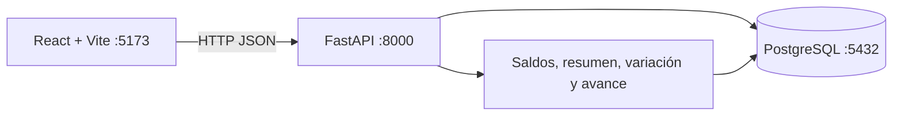
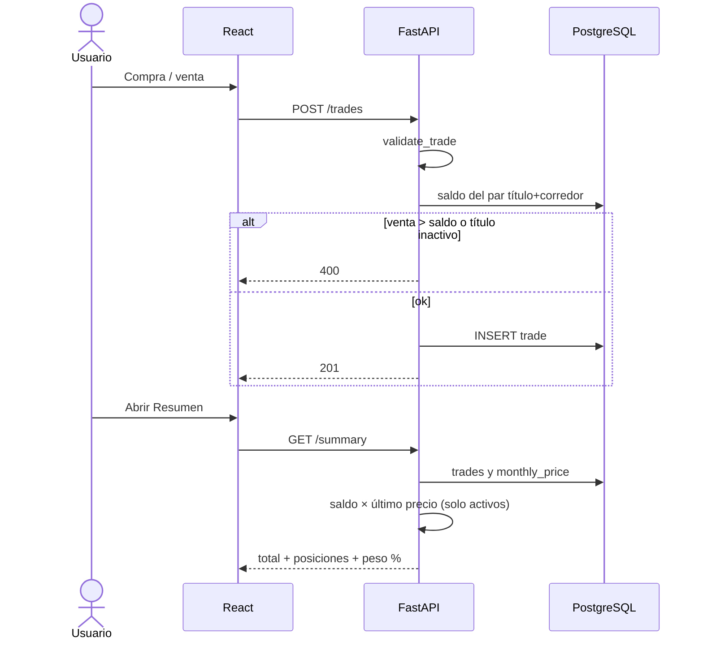
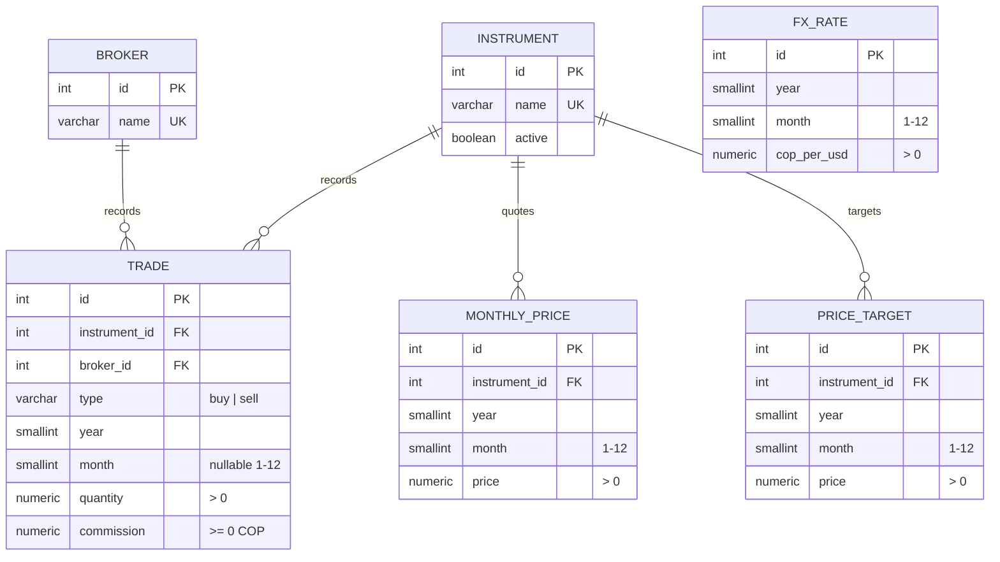
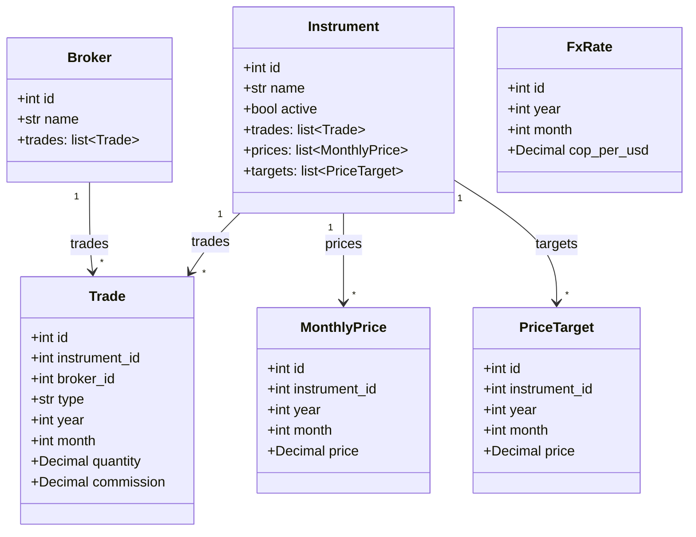
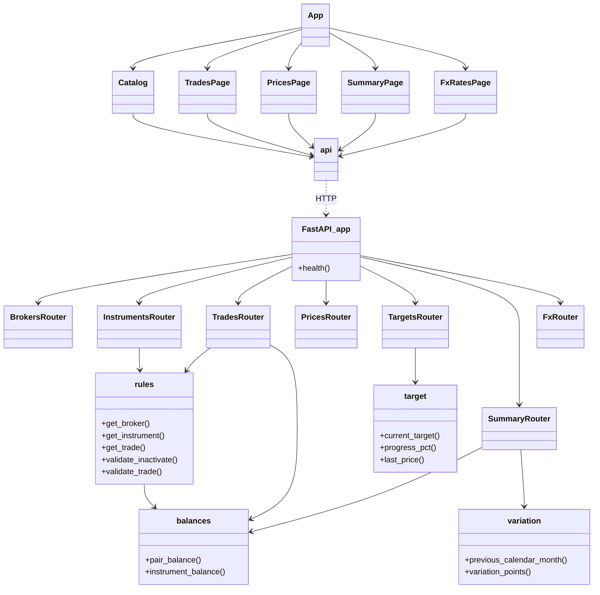

# Acciones

Registro y seguimiento de un portafolio de acciones colombianas (COP). Se cargan a mano las compras, las ventas, la comisión de cada operación, el precio de mercado mes a mes y el precio objetivo de venta por título. El saldo, el valor actual, los porcentajes y el avance al objetivo se calculan; no se guardan duplicados.

No hay login, no hay API de mercado ni importación de Excel. El precio pagado en la compra, la ganancia vs. costo y los dividendos quedan fuera de este alcance. La comisión es solo un gasto registrado: no resta del total del portafolio.

## Features

- **Catálogo** de títulos (instrumentos) y corredores, con nombres únicos.
- **Estado activo / inactivo** por título. Un inactivo no suma al total ni aparece en el peso %. Precios y movimientos se conservan.
- **Compras y ventas** por par título + corredor (año obligatorio, mes opcional, cantidad > 0, **comisión en COP** ≥ 0).
- **Saldo calculado**: `compras − ventas` por corredor. Venta parcial baja el saldo; venta total lo deja en 0; venta mayor al saldo se rechaza. No hay saldo negativo.
- **Precios mensuales** por título (no por corredor), en una grilla año × mes.
- **Aviso de precios del mes**: si a un título activo le falta el precio del mes en curso, Resumen y Precios muestran un banner. En Precios, esas celdas se marcan. El mes lo toma el navegador (no el reloj UTC del contenedor).
- **Precio objetivo de venta** por título, un valor por mes. El historial se conserva; el vigente es el de fecha más reciente. Mismo mes = se actualiza.
- **Resumen**: total actual = Σ (`saldo × último precio`) solo de títulos **activos**. Si falta precio, la posición se marca “sin precio” y no entra al total.
- **Gráficas**: peso % del portafolio (torta), variación % mensual del precio (línea) y **avance al objetivo** (`último mercado / objetivo vigente`). Un mes hueco no inventa variación ni avance.
- **Idioma**: selector ES / EN / IT en el header (`localStorage`). Los nombres de títulos y corredores no se traducen.
- **Vista COP / USD**: el COP es lo persistido. El dólar usa la TRM mensual cargada a mano (`cop_per_usd`). Si falta la tasa del mes, se muestra “sin TRM”; no se inventa.
- **Seed** inicial: 11 títulos (Ecopetrol, Celsia, ETB, GEB, Mineros, PG Argos, PG SURA, Cemagros, PF Cemagros, Grupo Argos, Grupo Sura) y 2 corredores (D Corredores, Trii).


### Reglas de negocio


| Situación                                              | Comportamiento                                                       |
| ------------------------------------------------------ | -------------------------------------------------------------------- |
| Mismo título en dos corredores                         | Dos tenencias, un solo precio de mercado                             |
| Inactivar con saldo > 0 (suma de todos los corredores) | Error 400                                                            |
| Compra de un título inactivo                           | Error 400; hay que reactivarlo primero                               |
| Borrar un movimiento si el saldo quedaría negativo     | Error 400                                                            |
| Borrar título o corredor con datos asociados           | Error 409                                                            |
| Variación de un mes                                    | Solo si existe precio en ese mes **y** en el mes calendario anterior |
| Comisión                                               | COP ≥ 0 en cada compra/venta; no entra al total                      |
| Avance al objetivo                                     | Solo si hay precio de mercado **y** objetivo vigente                 |
| Precios pendientes del mes                             | Solo títulos **activos** sin celda en el mes en curso                |
| Vista USD sin TRM del mes                              | No se convierte; se muestra “sin TRM”                                |


Moneda persistida: **COP**. USD es solo presentación: `monto_usd = monto_cop / cop_per_usd` con la TRM **de ese mes**.

## Cómo funciona

La UI (React) habla con la API (FastAPI). La API persiste el catálogo, los movimientos (con comisión), los precios y los objetivos en PostgreSQL. Saldos, valor, peso %, variación y avance al objetivo se derivan en cada consulta.




Flujo típico: dar de alta título y corredor → registrar compras (con comisión) → si el banner avisa, cargar precios del mes → fijar objetivo de venta → ver total, peso %, variación y avance en Resumen.




Al arrancar el contenedor `api` se ejecuta la migración Alembic, el seed del catálogo y Uvicorn.

## Stack


| Capa         | Tecnología                                                             |
| ------------ | ---------------------------------------------------------------------- |
| UI           | React 19, TypeScript, Vite 6, Tailwind CSS 3, React Router 7, Recharts, i18next |
| API          | Python 3.12, FastAPI, Pydantic v2, Uvicorn, **uv**                     |
| Persistencia | PostgreSQL 16, SQLAlchemy 2, Alembic                                   |
| Pruebas      | pytest, httpx (`TestClient`)                                           |
| Empaquetado  | Docker Compose (servicios `db`, `api`, `web`)                          |


## Cómo corre


### Con Docker (recomendado)

Requisitos: Docker Desktop.

Copia las variables y arranca (`.env` no se sube al git):

```bash
cp .env.example .env   # Windows: copy .env.example .env
docker compose up --build
```

Edita `.env` antes del primer `up` si quieres otras claves. Si Postgres ya se inicializó con el volumen `pgdata`, cambiar `POSTGRES_USER` / `POSTGRES_PASSWORD` / `POSTGRES_DB` **no** actualiza esa instancia; hay que borrar el volumen o restaurar un dump.


| Servicio   | URL                                                                                                                         |
| ---------- | --------------------------------------------------------------------------------------------------------------------------- |
| UI         | [http://localhost:5173](http://localhost:5173)                                                                              |
| API        | [http://localhost:8000](http://localhost:8000)                                                                              |
| Salud      | [http://localhost:8000/health](http://localhost:8000/health)                                                                |
| OpenAPI    | [http://localhost:8000/docs](http://localhost:8000/docs)                                                                    |
| PostgreSQL | `localhost:${POSTGRES_PORT}` — usuario / clave / BD en `.env`                                                               |
| pgAdmin    | [http://localhost:${PGADMIN_PORT}](http://localhost:${PGADMIN_PORT}) — `PGADMIN_DEFAULT_EMAIL` / `PGADMIN_DEFAULT_PASSWORD` |


Para dejarlo en segundo plano: `docker compose up --build -d`.

pgAdmin viene en el mismo Compose. En el árbol izquierdo abre **Servers → acciones**. La primera vez pide la clave de Postgres (`POSTGRES_PASSWORD`). Host interno: `db` (no `localhost`). Si cambias `POSTGRES_USER` o `POSTGRES_DB`, actualiza `pgadmin/servers.json`.

Solo pgAdmin, sin rebuild del resto:

```bash
docker compose up -d pgadmin
```


### Variables de entorno


| Variable                                              | Uso                                                                                  |
| ----------------------------------------------------- | ------------------------------------------------------------------------------------ |
| `POSTGRES_USER` / `POSTGRES_PASSWORD` / `POSTGRES_DB` | Usuario, clave y nombre de la BD                                                     |
| `POSTGRES_PORT`                                       | Puerto de Postgres en el host (default 5432)                                         |
| `DATABASE_URL`                                        | API/Alembic **fuera** de Compose (`localhost`). Compose monta otra URL con host `db` |
| `VITE_API_URL`                                        | Origen del API que usa el front                                                      |
| `PGADMIN_DEFAULT_EMAIL` / `PGADMIN_DEFAULT_PASSWORD`  | Login de pgAdmin                                                                     |
| `PGADMIN_PORT`                                        | Puerto de pgAdmin en el host (default 5050)                                          |


### Sin Docker

PostgreSQL 16, Python 3.12 y Node 22.

```bash
# API
cd backend
uv sync --group dev
# uv usa Python 3.12 (igual que Docker), no el 3.14 del sistema
# Lee DATABASE_URL desde ../.env
uv run alembic upgrade head
uv run python -m app.seed
uv run uvicorn app.main:app --reload --port 8000
```

```bash
# UI (otra terminal)
cd frontend
npm install
# opcional: VITE_API_URL=http://localhost:8000
npm run dev
```


### Pruebas del API

```bash
cd backend
uv run pytest
```

Los tests usan SQLite en memoria (no hace falta Postgres) y cubren salud, seed, ventas, inactivación, resumen, variación, comisión, avance al objetivo, precios pendientes y TRM. Dumps viejos (esquema en español) se restauran y luego `alembic upgrade head` aplica `003` (rename) y `004` (`fx_rate`).

## Scan de seguridad (Semgrep)

Instalación (una vez):

```powershell
python -m pip install semgrep
$env:PATH = "$(python -c "import sysconfig; print(sysconfig.get_path('scripts'))");$env:PATH"
```

Desde la raíz del repo:

```powershell
pysemgrep scan --metrics off --config p/owasp-top-ten --config p/security-audit --config p/secrets --config p/docker --config p/python --config p/javascript --config p/typescript --exclude htmlcov --exclude .venv --exclude node_modules --exclude backups
```

Cubre OWASP Top 10, auditoría, secretos, Docker, Python y JS/TS. Semgrep solo mira archivos **trackeados por git**, así que `.env` no entra en el scan.

```markdown
Todo desde cero:
# 1) Apagar y borrar contenedores, red, volúmenes e imágenes que construyó Compose (api y web)
docker compose down -v --rmi local
docker volume rm acciones_pgdata acciones_pgadmin_data acciones_web_nm
copy .env.example .env
docker compose up --build -d db
.\backups\backup.ps1 -Restore acciones_2026-09-10_1431.sql -Force
docker compose up --build -d

http://localhost:5173
```

## Backup de la base de datos

Los dumps van a `backups/` (esa carpeta está en `.gitignore`; no se suben al repo). El contenedor `db` tiene que existir; el script lo levanta si hace falta.

```powershell
.\backups\backup.ps1
```

Restaurar **pisa** la base actual (el `.sql` se busca en `backups/`):

```powershell
.\backups\backup.ps1 -Restore acciones_2026-09-10_1431.sql
```

`-Force` salta la confirmación (útil en scripts). `-Keep 12` borra dumps viejos y deja solo los 12 más recientes.

Para repetirlo el día 1 de cada mes a las 08:00 (Programador de tareas). Ajusta la ruta del proyecto:

```powershell
schtasks /Create /TN "Acciones backup" /SC MONTHLY /D 1 /ST 08:00 /RL LIMITED /F /TR "powershell.exe -NoProfile -ExecutionPolicy Bypass -File `"C:\Validation Information\2. New Projects\acciones\backups\backup.ps1`" -Keep 12"
```

El primer día hábil del mes no lo resuelve `schtasks` solo; el día 1 cubre el caso habitual. Docker Desktop tiene que estar abierto a esa hora.

## Estructura

```
acciones/
├── docker-compose.yml
├── .env.example
├── backups/backup.ps1
├── pgadmin/servers.json
├── backend/
│   ├── Dockerfile
│   ├── pyproject.toml
│   ├── uv.lock
│   ├── alembic.ini
│   ├── alembic/versions/        # 001 3FN, 002 comisión + objetivo, 003 inglés, 004 TRM
│   ├── app/
│   │   ├── main.py              # FastAPI, CORS, /health
│   │   ├── config.py            # DATABASE_URL (sin default; sale del entorno)
│   │   ├── database.py          # engine, sesión, Base
│   │   ├── models.py            # ORM 3FN (inglés)
│   │   ├── schemas.py           # Pydantic de entrada/salida
│   │   ├── seed.py              # 11 títulos + 2 corredores
│   │   ├── routers/             # brokers, instruments, trades, prices, targets, summary, fx
│   │   └── services/            # rules, balances, variation, target
│   └── tests/
└── frontend/
    ├── Dockerfile
    ├── src/
    │   ├── main.tsx
    │   ├── App.tsx              # rutas, idioma y COP/USD
    │   ├── api.ts               # cliente HTTP
    │   ├── i18n.ts              # es / en / it
    │   ├── BannerPrecios.tsx    # aviso de huecos del mes en curso
    │   └── pages/               # Summary, Prices, Trades, Catalog, FxRates
    └── ...
```

Pantallas:


| Ruta        | Pantalla                                                                              |
| ----------- | ------------------------------------------------------------------------------------- |
| `/`         | Total, posiciones, peso %, variación %, avance; banner si faltan precios del mes      |
| `/prices`   | Grilla mes × título; banner y celdas ámbar del mes en curso                           |
| `/trades`   | Alta, edición y borrado de compras/ventas (con comisión)                              |
| `/catalog`  | Títulos, corredores, activar/inactivar                                                |
| `/fx`       | TRM mensual (COP por 1 USD)                                                           |


### API


| Método           | Ruta                                  | Notas                                             |
| ---------------- | ------------------------------------- | ------------------------------------------------- |
| GET              | `/health`                             | `{ "status": "ok" }`                              |
| CRUD             | `/brokers`                            | Nombre único                                      |
| CRUD             | `/instruments`                        | Incluye `active`; inactivar valida saldo 0        |
| CRUD             | `/trades`                             | Valida saldo en ventas y título activo en compras; `commission` ≥ 0 |
| GET, PUT, DELETE | `/prices`                             | PUT es upsert por título + año + mes                              |
| GET              | `/prices/pending?year=&month=`        | Títulos activos sin precio en ese periodo                         |
| GET, PUT, DELETE | `/targets`                            | PUT es upsert por título + año + mes; historial por título        |
| GET              | `/target-progress?instrument_id=`     | `null` si falta mercado u objetivo vigente                        |
| GET              | `/balances`                           | Calculado; no se persiste                                         |
| GET              | `/summary`                            | Total y peso % solo activos; la comisión no resta                 |
| GET              | `/price-variation?instrument_id=`     | `null` si falta el mes anterior                                   |
| GET, PUT, DELETE | `/fx-rates`                           | PUT es upsert por año + mes; `cop_per_usd` > 0                    |


## Diagrama de la base de datos

Seis tablas en **tercera forma normal**. El saldo, los porcentajes y el avance al objetivo son consultas, no tablas. El precio de mercado, el objetivo y la TRM no dependen del corredor.




Restricciones:

- `trade.type` ∈ `{buy, sell}`; `quantity > 0`; `commission >= 0`; `month` nulo o entre 1 y 12.
- `monthly_price` y `price_target` únicos por (`instrument_id`, `year`, `month`); `price > 0`.
- `fx_rate` único por (`year`, `month`); `cop_per_usd > 0`.
- FKs: `trade` → `instrument` y `broker`; `monthly_price` y `price_target` → `instrument`.

Por qué es 3FN: cada atributo no clave depende solo de la PK. No se copia el nombre del título en trade, precio ni objetivo. El saldo, el avance y la vista USD se obtienen de consultas.

## Diagrama de clases


### Dominio (SQLAlchemy)




### API y UI




DTOs Pydantic (entrada/salida, no persistidos): `BrokerIn/Out`, `InstrumentIn/Update/Out`, `TradeIn/Out`, `PriceIn/Out`, `TargetIn/Out`, `TargetProgressOut`, `BalanceOut`, `PositionOut`, `SummaryOut`, `VariationOut`, `FxRateIn/Out`.