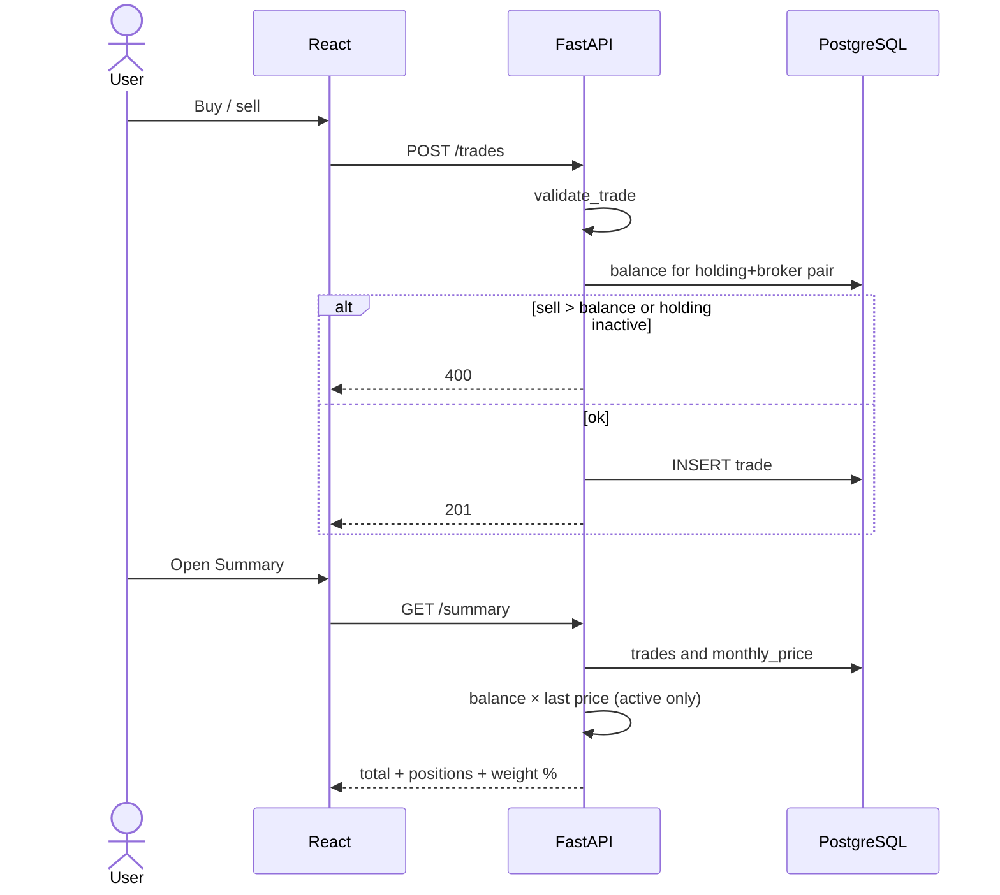
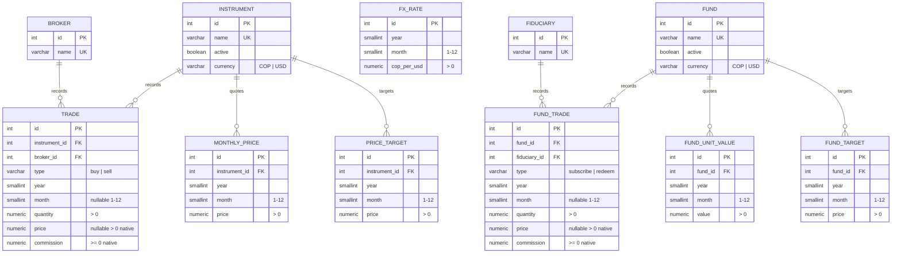
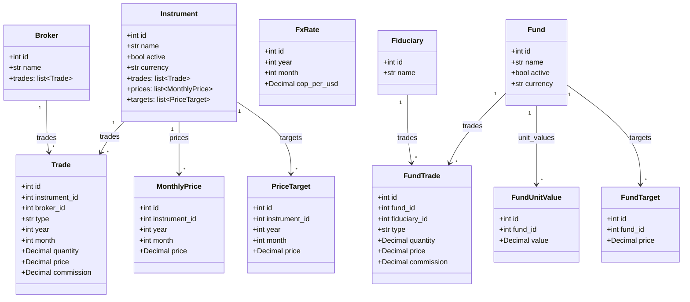

# Stocks

**English** | [Español](README.es.md)


Track a stock portfolio in Colombia (COP) and the United States (USD), plus Colombian collective funds (FIC) in the same app. Buys, sells, subscriptions, redemptions, per-trade commission, month-by-month market or unit values, and a sell target are entered by hand. Balance, current value, percentages, and progress to target are calculated; they are not stored twice.

## Features

- **Catalog** of holdings (instruments) and brokers, with unique names. Each holding has a quote currency: **COP** or **USD**. A holding’s name can be changed in Catalog; prices and trades stay on the same row.
- **Active / inactive** state per holding. An inactive one does not add to the total or appear in weight %. Prices and trades are kept.
- **Buys and sells** per holding + broker pair (year required, month optional, quantity > 0, **price per share** of that trade, **commission in the holding’s currency** ≥ 0). The trade price is not the monthly market price.
- **Calculated balance**: `buys − sells` per broker. A partial sell lowers the balance; a full sell leaves it at 0; a sell larger than the balance is rejected. There is no negative balance.
- **Monthly prices** per holding (not per broker), in a year × month grid.
- **Missing-price banner**: if an active holding lacks the current month’s price, Summary and Prices show a banner. On Prices, those cells are marked. The month comes from the browser (not the container’s UTC clock).
- **Sell target price** per holding, one value per month. History is kept; the current target is the most recent date. Same month = update.
- **Summary**: current total = Σ (`balance × last price`) for **active** holdings only. If the price is missing, the position is marked “no price” and stays out of the total.
- **Charts**: portfolio weight % (pie), monthly price % change (line), and **progress to target** (`last market / current target`). A gap month does not invent a change or a progress point.
- **Theme, language, display currency**: compact selects in the header (dark / light, ES / EN / IT, COP / USD). Preference is stored in `localStorage`. Holding and broker names are not translated.
- **Quote currency vs display**: market prices, targets, trade price, and commission are stored in the holding’s currency. The header COP / USD toggle converts with that month’s TRM (`cop_per_usd`). Same-currency view does not need a rate. If the rate is missing for a cross-currency amount, the UI shows “no FX”; it does not invent one.
- **Funds (FIC)**: separate catalog of funds and fiduciaries (not brokers). Subscriptions and redemptions per fund + fiduciary; monthly **unit value** (not written from the trade); target per fund. Same rules as stocks: no over-redeem, no subscribe to an inactive fund, no deactivate with units > 0.
- **Combined summary**: `GET /wealth` adds the stock total and the fund total. The UI shows one combined total and two blocks (weight %, unit-value change, and target progress per module). Exchange-listed ETFs stay as holdings; FICs do not reuse `trade` or `broker`.
- **Initial seed**: 11 holdings (Ecopetrol, Celsia, ETB, GEB, Mineros, PG Argos, PG SURA, Cemagros, PF Cemagros, Grupo Argos, Grupo Sura), all **COP**, and 2 brokers (D Corredores, Trii). The FIC catalog starts empty.


## Demo


Fictional portfolio in `demo/demo.sql`. To run the app with this data, see [Try it with the demo database](#try-it-with-the-demo-database).

### Business rules


| Situation                                              | Behavior                                                            |
| ------------------------------------------------------ | ------------------------------------------------------------------- |
| Same holding at two brokers                            | Two positions, one market price                                     |
| Deactivate with balance > 0 (sum across all brokers)   | 400 error                                                           |
| Buy an inactive holding                                | 400 error; reactivate it first                                      |
| Delete a trade if the balance would go negative        | 400 error                                                           |
| Delete a holding or broker that still has related data | 409 error                                                           |
| Change for a month                                     | Only if that month **and** the previous calendar month have a price |
| Trade price per share                                  | Optional on old rows; if set, > 0 in the holding’s currency. Not the monthly market price; does not change Summary total |
| Commission                                             | ≥ 0 in the holding’s currency; not part of the total                |
| Change a holding’s quote currency                      | 400 error if it already has trades, prices, or targets              |
| Progress to target                                     | Only if there is a market price **and** a current target            |
| Pending prices for the month                           | Only **active** holdings missing a cell in the current month        |
| Cross-currency view without that month’s FX rate       | No conversion; the UI shows “no FX”                                 |
| Redeem more units than the fund+fiduciary balance      | 400 error                                                           |
| Deactivate a fund with units > 0                       | 400 error                                                           |
| Fund trade unit price or commission                    | Stored on the movement; does not write `fund_unit_value` or change the total |
| Combined wealth                                        | Stocks total + funds total (only active rows with a price / unit value) |


Persisted currency: **COP or USD per holding**. The header toggle is display only: `amount_usd = amount_cop / cop_per_usd` and `amount_cop = amount_usd × cop_per_usd` with that **month’s** TRM.

## How it works

Typical flow: add holding (COP or USD) and broker → record buys (price per share and commission in that currency) → if the banner warns, enter this month’s **market** prices → set a sell target → see total, weight %, change, and progress on Summary. Use the header toggle to view the mixed portfolio in COP or USD.




On start, the `api` container runs the Alembic migration, the catalog seed, and Uvicorn.

## Stack


| Layer       | Technology                                                                      |
| ----------- | ------------------------------------------------------------------------------- |
| UI          | React 19, TypeScript, Vite 6, Tailwind CSS 3, React Router 7, Recharts, i18next |
| API         | Python 3.12, FastAPI, Pydantic v2, uv                                           |
| Persistence | PostgreSQL 16, SQLAlchemy 2, Alembic                                            |
| Tests       | pytest, httpx (`TestClient`)                                                    |
| Packaging   | Docker Compose (`db`, `api`, `web` services)                                    |


## How to run

### With Docker (recommended)

Requirements: Docker Desktop.

Copy environment variables to (`.env`):

```bash
cp .env.example .env   # Windows: copy .env.example .env
docker compose up --build
```

Note: Edit `.env` before the first `up` if you want different secrets. If Postgres was already initialized with the `pgdata` volume, changing `POSTGRES_USER` / `POSTGRES_PASSWORD` / `POSTGRES_DB` does **not** update that instance; you have to delete the volume or restore a dump.


| Service    | URL                                                                                                                         |
| ---------- | --------------------------------------------------------------------------------------------------------------------------- |
| UI         | [http://localhost:5173](http://localhost:5173)                                                                              |
| API        | [http://localhost:8000](http://localhost:8000)                                                                              |
| Health     | [http://localhost:8000/health](http://localhost:8000/health)                                                                |
| OpenAPI    | [http://localhost:8000/docs](http://localhost:8000/docs)                                                                    |
| PostgreSQL | `localhost:${POSTGRES_PORT}` — user / password / DB in `.env`                                                               |
| pgAdmin    | [http://localhost:${PGADMIN_PORT}](http://localhost:${PGADMIN_PORT}) — `PGADMIN_DEFAULT_EMAIL` / `PGADMIN_DEFAULT_PASSWORD` |


To run in the background: `docker compose up --build -d`.

### Try it with the demo database

The first start only seeds the catalog (holding names, empty portfolio). To explore a complete example — buys, a partial sell, monthly prices, targets, mixed COP/USD — restore `demo/demo.sql` (this **overwrites** the current database):

```powershell
docker compose up --build -d
.\backups\backup.ps1 -Restore demo\demo.sql -Force
```

Then open [http://localhost:5173](http://localhost:5173). You should see Cafe Andino, Sol Energia, Rio Banco, Sierra Metales (COP) and **Nube Telecom** (USD). If you already have data you care about, dump it first with `.\backups\backup.ps1`.

pgAdmin ships in the same Compose file. In the left tree open **Servers → stocks**. The first time it asks for the Postgres password (`POSTGRES_PASSWORD`). Internal host: `db` (not `localhost`). If you change `POSTGRES_USER` or `POSTGRES_DB`, update `pgadmin/servers.json`.

pgAdmin only, without rebuilding the rest:

```bash
docker compose up -d pgadmin
```


### Environment variables


| Variable                                              | Use                                                                                      |
| ----------------------------------------------------- | ---------------------------------------------------------------------------------------- |
| `POSTGRES_USER` / `POSTGRES_PASSWORD` / `POSTGRES_DB` | Database user, password, and name                                                        |
| `POSTGRES_PORT`                                       | Postgres port on the host (default 5432)                                                 |
| `DATABASE_URL`                                        | API/Alembic **outside** Compose (`localhost`). Compose mounts another URL with host `db` |
| `VITE_API_URL`                                        | API origin used by the frontend                                                          |
| `PGADMIN_DEFAULT_EMAIL` / `PGADMIN_DEFAULT_PASSWORD`  | pgAdmin login                                                                            |
| `PGADMIN_PORT`                                        | pgAdmin port on the host (default 5050)                                                  |


## Layout

```
acciones/
├── docker-compose.yml
├── .env.example
├── LICENSE
├── README.md
├── README.es.md
├── backups/backup.ps1
├── demo/
│   ├── demo.sql             # fictional portfolio (does go to git)
│   ├── demo.gif             # walkthrough in the README
│   └── demo-thumb.png       # preview if there is a YouTube/Loom video
├── pgadmin/servers.json
├── backend/
│   ├── Dockerfile
│   ├── pyproject.toml
│   ├── uv.lock
│   ├── alembic.ini
    │   ├── alembic/versions/        # 001 3NF, 002 commission + target, 003 English, 004 FX, 005 currency, 006 price, 007 funds
    │   ├── app/
    │   │   ├── main.py              # FastAPI, CORS, /health, /wealth
    │   │   ├── config.py            # DATABASE_URL (no default; comes from the environment)
    │   │   ├── database.py          # engine, session, Base
    │   │   ├── models.py            # 3NF ORM (English) + FIC model import
    │   │   ├── schemas.py           # Pydantic input/output
    │   │   ├── seed.py              # 11 holdings + 2 brokers (only if the catalog is empty)
    │   │   ├── seed_demo.py         # fictional README portfolio
    │   │   ├── routers/             # brokers, instruments, trades, prices, targets, summary, fx, wealth
    │   │   ├── services/            # rules, balances, variation, target
    │   │   └── funds/               # FIC models, schemas, routers, services
    │   └── tests/
    └── frontend/
    ├── Dockerfile
    ├── src/
    │   ├── main.tsx
    │   ├── App.tsx              # routes, Acciones/Fondos switch, theme, language, COP/USD
    │   ├── api.ts               # HTTP client
    │   ├── i18n.ts              # es / en / it
    │   ├── theme.tsx            # dark / light
    │   ├── BannerPrecios.tsx    # missing price / unit value for the current month
    │   └── pages/               # Summary, Prices, Trades, Catalog, FxRates, funds/
    └── ...
```


## Database diagram




Constraints:

- `instrument.currency` ∈ `{COP, USD}` (default COP).
- `trade.type` ∈ `{buy, sell}`; `quantity > 0`; `commission >= 0`; `price` null or `> 0`; `month` null or between 1 and 12.
- `monthly_price` and `price_target` unique per (`instrument_id`, `year`, `month`); `price > 0`.
- `fx_rate` unique per (`year`, `month`); `cop_per_usd > 0`.
- FKs: `trade` → `instrument` and `broker`; `monthly_price` and `price_target` → `instrument`.
- `fund.currency` ∈ `{COP, USD}` (default COP).
- `fund_trade.type` ∈ `{subscribe, redeem}`; `quantity > 0`; `commission >= 0`; `price` null or `> 0`.
- `fund_unit_value` and `fund_target` unique per (`fund_id`, `year`, `month`).
- FKs: `fund_trade` → `fund` and `fiduciary`; `fund_unit_value` and `fund_target` → `fund`.

Why it is 3NF: every non-key attribute depends only on the PK. The holding name is not copied onto trade, price, or target. Balance, progress, and COP/USD display conversion come from queries.

## Class diagram


### Domain (SQLAlchemy)




## License

MIT. See [LICENSE](LICENSE).

If this project is useful to you, consider starring the repository ⭐ Your support helps the project makes it easier for others to discover.